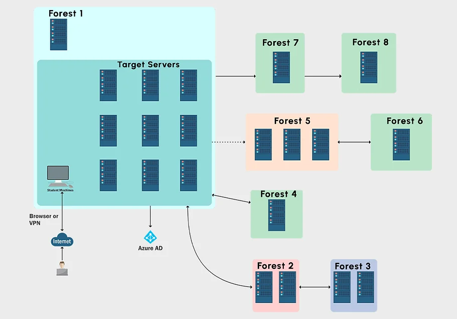
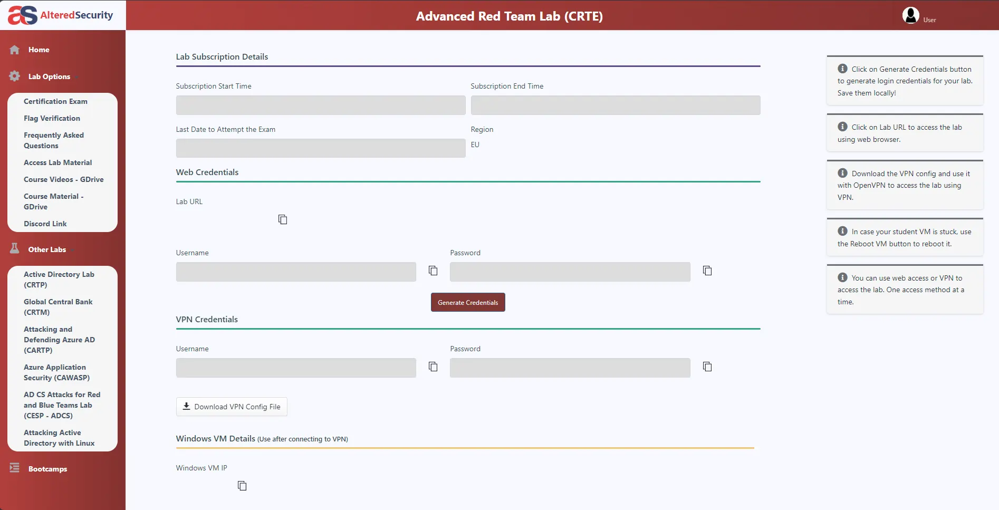

Retour d'expérience sur la certification "Certified Red Team Expert" par Altered Security.

## Introduction

Cette certification est proposée dans la continuité de la CRTP, pour laquelle j’ai déjà fait un retour d'expérience:

[Retour d'experience CRTP](https://docs.contactit.fr/fr/certifications/crtp/)

Elle vise à approfondir des connaissances en Active Directory, notamment dans un environnement comprenant plusieurs forêts, l'évasion de solutions de sécurité (Defender, MDE, MDI) par l'obfuscation de binaire/scripts powershell et une opsec assez poussée.

---

## Début

Lorsque vous achetez la CRTE (300$), vous devrez renseigner une adresse email. Il est préférable d'utiliser une adresse Gmail (pour l'apprenant) afin d'éviter d'avoir à contacter le support plus tard, car l'authentification sur la plateforme d'apprentissage se fait exclusivement via un compte Google.

 Vous aurez donc accès aux différentes ressources de la certification dans la section **"Access Lab Material"**, qui vous redirigera vers un lien onedrive dans lequel vous retrouverez les diagrammes, les vidéos explicatives (CourseVideos correspond aux vidéos du bootcamp et WalktroughVideos aux chemins de compromission du lab), un **"LabManual_Covenant"** qui concerne l'application du cours, mais en utilisant un C2 (non à jour doit être mis à jour avec sliver) et une archive renfermant tous les outils nécessaires à l'apprentissage de la certification (Tools.zip).  

 Il est fortement recommandé de lire la section **"Frequently Asked Questions"**.

 Concernant le cours, il y a **30 "Objectifs d'apprentissage"**, chacun d'entre eux vous indique un objectif à atteindre (une ou plusieurs informations à renseigner) par l'énumération/exploitation de l'environnement du lab sur un sujet en particulier ou pour pivoter sur une autre machine. Celui-ci couvre de la reconnaissance/énumération/exploitation Kerberos aux attaques sur les certificats, l'abus de relations de confiance entre forêts et l'exploitation de serveurs SQL tout en prenant en compte une importante gestion du bruit et de l'opsec afin de contourner Defender et Microsoft defender for Endpoints/Identity (MDE/MDI). Attention à la détection comportementale de MDI ! Il peut être judicieux de ne demander qu'un ticket à la fois, de ne pas faire d'action de masse, de ne pas dump le processus lsass, de mettre des délais aléatoires entre les actions... Ces éléments sont activement monitorés par MDI !

L'environnement d'apprentissage et celui du passage de la certification sont similaires, notamment au niveau des mesures de sécurité :
Tous les serveurs sont sous **Windows Server 2019** (Pas encore mis à jour vers 2022 en date, il n'y a pas de différences pratiques entre les 2 versions de Windows Server) avec les **mises à jour de sécurité appliquées en date**, le **firewall Windows et Defender sont actifs**, certains serveurs sont en version **"core"**, de plus des mécanismes de sécurité comme **WDAC/gMSA/LAPS**. Une grosse marche en plus niveau sécurité par rapport à l'environnement de la CRTP. **La présence de mauvaises configurations/ACL permet la compromission des machines.**

 les retours d'expériences, les anecdotes, les explications détaillées des concepts ; que l'on peut écouter avec les vidéos du bootcamp animées par **Nikhil Mittal** (Fondateur d'Altered Security) et **Munaf Sahriff** maintenant.

---

## Examen

 **Je me dois de rester asser évasif pour ne pas spoil le set d'examen.** Au cours de l'examen, le candidat aura pour mission de mener à bien une **exécution de commandes sur les machines dans le scope du lab** (au moins 4 pour réussir l'examen, excepté la vm fournie). Il n'est pas requis d'obtenir les droits d'administrateur local sur ces machines, d'autant plus qu'aucun flag n'est à collecter. Le candidat disposera de **48 heures**, incluant une heure supplémentaire allouée pour l'installation des outils nécessaires, afin de compromettre la totalité du lab (ou presque) et de réaliser des captures d'écran qui attestent de la méthode de compromission employée, enrichissant ainsi le rapport final qui doit être le plus irréprochable possible.  

 **Microsoft Defender est actif sur l'ensemble des machines**. Defender peut être désactivé si vous disposez des privilèges d'administrateur local, il faudra conformément au cours, bypass defender au moins lors d'une étape.  

:::danger[Bypass MDE]
Suite aux retours des étudiants, Nikhil a accepté d'intégrer une méthode de contournement de MDE. Cependant, il est important de noter que cette approche pourrait devenir inefficace à tout instant. En effet, MDE s'enrichit continuellement de nouvelles données et pourrait, à n'importe quel moment, bloquer cette technique de contournement.
:::

Durant l'examen, les techniques telles que le bruteforce, le guessing, bypass MDE, l'abus de certificats ou l'exploitation de vulnérabilités connues (CVE) ne sont pas utiles.  

Après avoir lancé l'examen, la liste des machines est apparue sur l'interface en une dizaine de minutes. Il est désormais nécessaire de générer les identifiants pour se connecter à la première machine, étant donné que les certifications d'Altered Security sont basées sur un scénario "Assumed Breach". Rappelons que Windows Defender est actif, il faudra donc effectuer l'escalade de privilèges et/ou l'énumération en tenant compte de cet élément. J'ai réussi à augmenter mes privilèges, à désactiver les protections sur la machine pour plus de sérénité, à dumper lsass et à énumérer le domaine actuel.  

 Les premier et deuxième mouvements nécessitent du temps, de la logique, une énumération spécifique et de la recherche/documentation. J'ai pu les passer après quelques heures, tout en rédigeant un brouillon du rapport avec des captures d'écran. 

 Le troisième mouvement est facilement identifiable après une énumération de la forêt dans laquelle nous nous trouvons maintenant. J'ai pu l'exploiter rapidement et la compromettre.  

 les quatre machines étaient accessibles et pour la dernière, le vecteur d'attaque était une formalité.  

 Certes, il y a cinq machines dans le lab, mais la difficulté et le temps nécessaire par mouvement peuvent être importants. Les premiers mouvements ne sont pas forcément évidents et peuvent comprendre de nombreuses étapes, générant parfois une certaine frustration, notamment en cas de blocage sur la première machine à compromettre. Il est important de ne pas oublier de lire la documentation des outils, de consulter les cheatsheets habituelles (hacktricks, thehacker.recipes) et surtout, de tester.

---

## Rapport

Le rapport devra être rédigé intégralement en **anglais**. Il conviendra de suggérer des **mesures correctives pour les configurations inappropriées identifiées**, et d'ajouter des références à des **articles de blog** pour renforcer la crédibilité du document. Il est également essentiel d'expliquer le fonctionnement des outils utilisés et les raisons de leur choix. Mon rapport individuel a été créé à l'aide de [sysreptor](https://github.com/Syslifters/sysreptor) et le template [Altered-Security-Reporting](https://github.com/didntchooseaname/Altered-Security-Reporting), que j'ai pu créer avec l'aide de 2 contributeurs sur base du template calzone. L'objectif du projet est de gagner du temps sur la forme, automatiser les élements comme la strcture de l'Executive Summary et la Table des matières et surtout, de ne remplir que la partie *fonctionnelle* du document comme le *périmètre* et les *vecteurs d'attaques*.

---

## Conclusion

 La CRTE requiert des fondamentaux solides en test d'intrusion Active Directory. Vous pouvez donc vous lancer dans cette aventure si vous avez déja passé la CRTP ou que vous êtes un junior/professionnel en poste de pentest avec des missions similaires.

 Il est tout à fait possible de passe la CRTE en deux semaines, la structure est globalement la même que la CRTP, mais plus complexe avec un environnement plus vaste également. **Toutes les ressources sont accessibles à vie** y compris les futurs mise à jour. À noter toutefois, que **le passage de la certification est moins complexe que le lab d'entraînement** (dû aux 48 heures d'activité de celui-ci). Il vous sera demandé par la suite, un **rapport de compromission en anglais**, détaillant l'ensemble des **observations, mauvaises configurations, outils utilisés, sources de POC et recommandations de remédiation pour chaque élément sur l'environnement** (les recommandations rapportent plus de points mais ne sont pas obligatoires). Ce rapport est rédigé et envoyé sous **48 heures maximum** après la fin d'activité du lab d'examen. Vous pouvez également préciser que l'anglais n'est pas votre langue natale, dans le cas où cela représente une gêne dans votre expression. L'équipe d'Altered Security en tiendra compte lors de la revue de votre rapport.