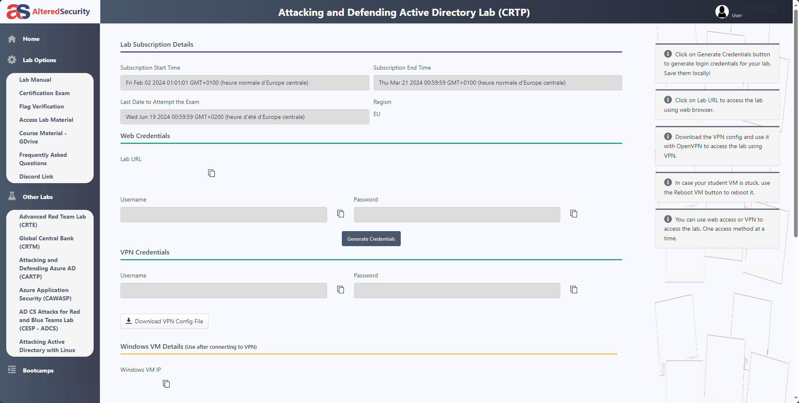
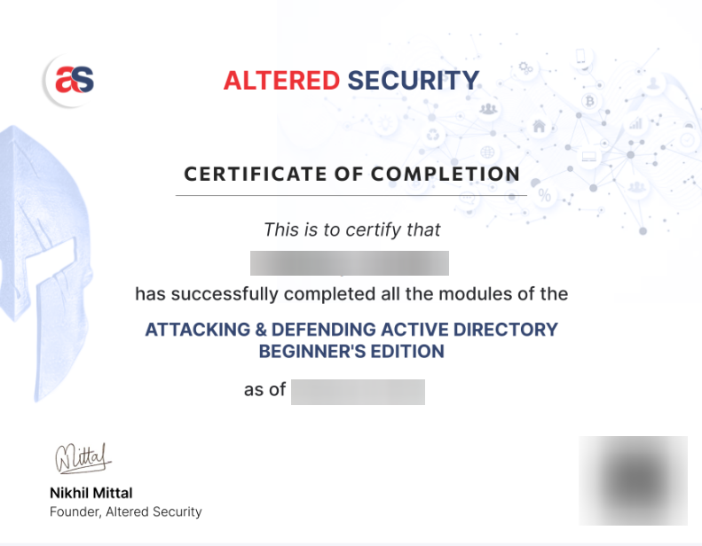

import { Icon } from '@astrojs/starlight/components';

Retour d'expérience sur la certification "Certified Red Team Professional" par Altered Security.

## Introduction

**Altered Security** (anciennement Pentester Academy) a été fondé par **Nikhil Mittal** Et propose des certifications axées **sécurité offensive** (Red Team) en environnement **Active Directory**. Nikhil est reconnu mondialement pour son expertise en Red Team AD, il a d'ailleurs pu donner de nombreuses conférences comme celles à la DefCon [RACE - Minimal Rights and ACE for Active Directory Dominance](https://www.youtube.com/watch?v=F_Fy7M1AO_Q), [Powershell for Penetraton Testers](https://www.youtube.com/watch?v=PezFo2Y1BUA) ou [PowerPreter Post Exploitation Like a Boss](https://www.youtube.com/watch?v=NXydblaJaZQ).

 Les certifications qu'il propose avec Altered Security sont **reconnues** (en France également), en particulier par les **entreprises spécialisées** (type ESN proposant des services de test d'intrusion à leurs clients).

---

## Début

Lorsque vous achetez la CRTP (249$ ou 300$ avec le bootcamp) vous devrez renseigner une adresse email, mettre une **adresse Gmail vous épargnera de devoir contacter le support par la suite**, puisque l'authentification à la plateforme d'apprentissage se fait uniquement via un **compte google**.

 différents du bootcamp), le **"Lab Manual"** qui est le cours principal (même chôse que la section "Lab Manual"), le dossier **"Sliver_C2"** qui concerne l'application du cours, mais en utilisant un C2 et une archive renfermant tous les outils nécessaires à l'apprentissage de la certification.  

 Il est fortement recommandé de lire la section **"Frequently Asked Questions"** qui comme son nom l'indique, répondra à beaucoup de vos questions.

 Concernant le cours, il y a **24 "Objectifs d'apprentissage"**, chacun d'entre eux vous indique un objectif à atteindre (une ou plusieurs informations à renseigner) par l'énumération/exploitation de l'environnement du lab. Celui-ci couvre de la reconnaissance/énumération/exploitation Kerberos aux attaques sur les certificats et l'exploitation de serveurs SQL tout en prenant en compte la gestion du bruit et de l'opsec.

L'environnement d'apprentissage et celui du passage de la certification sont très similaires notamment au niveau des mesures de sécurité :
Tous les serveurs sont sous **Windows Server 2022** avec les **mises à jour de sécurité appliquées en date**, le **firewall Windows et Defender sont actifs**, certains serveurs sont en version **"core"** et il y a des politiques **applocker**. Autant dire que le niveau de sécurité est important par rapport à un environnement de production d'une PME. **La présence de mauvaises configurations permet la compromission des machines.**

L'entrée en matière de la CRTP commence d'ailleurs, avec le **contournement de ces protections**.  

Quand vous compléterez l'ensemble des objectifs d'apprentissage avec succès, vous pourrez télécharger un certificat :

---

## Bootcamp

 Je recommande fortement de prendre le **bootcamp** (lives et vidéos) en complément de la certification que vous soyez **débutant dans le domaine du Red Teaming et d'Active Directory** ou non. Le bootcamp se compose de 4 sessions vidéos en **live avec Nikhil** chaque dimanche pendant **4 heures** (les rediffusions sont disponibles et téléchargeables).  

 Il ajoute une **réelle plus-value** à l'apprentissage et permet d'avoir des bases solides et ira vraiment plus loin que le cours de la plateforme. Notamment en allant plus en profondeur dans les concepts de **gestion des logs Windows et du bruit**, afin de rester le plus possible non détecté par les solutions de sécurité. Cela passe par **l'obfuscation de scripts communs** comme **"Mimikatz"**, la **désactivation/Neutralisation des mesures de sécurité liées à PowerShell** (ScriptBlock logging, Module logging, Transcription, AMSI) jusqu'à **l'explication de chaque argument passé** aux commandes et l'obfuscation de ceux-ci également.  

 **La gestion du bruit est un élément qui vous suivra tout au long de ce bootcamp** et Nikhil ne manquera pas de vous rappeler son importance et de vous donner à chaque fois plusieurs exemples sur le lab pratique. Il sera également à votre écoute et n'hésitera pas à lire vos questions dans le tchat, il vous en posera également à son tour, nous avons donc **un réel échange entre l'enseignant et les étudiants**. Le serveur Discord prévu à cet éffet centralisera les différentes informations du bootcamp et vous permettra également **d'échanger avec les différents apprenants**.

 Dans le package de la certification vous avez également un **accès à une instance Microsoft defender for Endpoints (MDE) sur le périmètre** qui vous permet de voir également une partie de la vue du côté défense.

---

## Éxamen

<Icon name="right-arrow" /> Au cours de l'examen, le candidat aura pour mission de mener à bien une **exécution de commandes sur les cinq machines du lab**. Il n'est pas requis d'obtenir les droits d'administrateur local sur ces machines, d'autant plus qu'aucun flag n'est à collecter. Le candidat disposera de **24 heures**, incluant
une heure supplémentaire allouée pour l'installation des outils nécessaires, afin de
compromettre la totalité du lab et de réaliser des captures d'écran qui attestent de
la méthode de compromission employée, enrichissant ainsi le rapport final.  

 **Microsoft Defender est actif sur l'ensemble des machines**. Il peut être désactivé si vous disposez des privilèges d'administrateur local. Il est important de souligner qu'**une machine nécessitera son contournement**, par les moyens appris pendant le cours. Durant l'examen, les techniques telles que le bruteforce, le guessing, l'abus de certificats ou l'exploitation de vulnérabilités connues (CVE) ne sont pas utiles.

---

## Rapport

- **Titre**
- **Sommaire**
- **Schéma de compromission**
- **Description détaillée des étapes**
- **Conclusion**
- **Présentation des outils utilisés**
- **Références aux articles de blog consultés**

---

## Conclusion

 Il n'est pas forcément nécessaire de se préparer en faisant des boxs de plateformes en ligne (HackTheBox/ProLabs/TryHackMe...), si vous possédez déjà un background en **administration système en environnement Active Directory en production** et que vous avez déjà creusé le **fonctionnement** de ce dernier. Commencer par le bootcamp de la CRTP est tout à fait faisable. Si vous êtes vraiment débutant et que vous n'avez jamais été confronté à ces concepts, il sera préférable de **gagner de l'expérience**, soit par **la pratique en entreprise** si possible, soit par **l'apprentissage via les plateformes** précédemment énoncées.  

 Avec des bases solides et un investissement conséquent, il est possible de passer la CRTP en (en moyenne) deux semaines. Toutefois si vous prenez un accès de 30 jours au Lab, **vous bénéficierez de deux semaines supplémentaires offertes**. **Toutes les ressources sont accessibles à vie** y compris les futurs mise à jour. À noter toutefois, que **le passage de la certification est moins complexe que le lab d'entraînement** (dû aux 24 heures d'activité de celui-ci). Il vous sera demandé par la suite, un **rapport de compromission en anglais**, détaillant l'ensemble des **observations, mauvaises configurations, outils utilisés, sources de POC et recommandations de remédiation pour chaque élément sur l'environnement** (les recommandations rapportent plus de points mais ne sont pas obligatoires). Ce rapport est rédigé et envoyé sous **48 heures maximum** après la fin d'activité du lab d'examen. Vous pouvez également préciser que l'anglais n'est pas votre langue natale, dans le cas où cela représente une gêne dans votre expression. L'équipe d'Altered Security en tiendra compte lors de la revue de votre rapport.