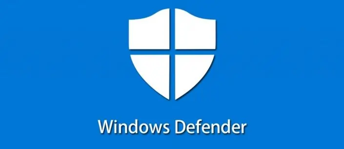

import { Steps } from '@astrojs/starlight/components';

Révisions

Auteur | Date | Changes
--- | --- | ---
contactit.fr | 01/09/2023 | Initial push

Windows Defender est l'organe **natif** de **sécurité** des distributions **Windows**. Souvent considéré comme étant "peu efficace", sont potentiel réél est mal connu. Ce que l'on peut reprocher à Defender en revanche, c'est d'être un peux trop **minimal** au niveau de la protection offerte **par défaut** sur les machines.  

C'est tout à fait compréhensible, puisque comme à son habitude, Windows se doit d'être : rétro compatible, de coller au maximum de cas d'usages possibles. C'est pourquoi Windows a jugé pertinent la configuration basique qui est effective pour tout le monde. Comme nous le savons tous **les utilisateurs ne vont que très rarement faire un tour des paramètres.**  

**Plus la sécurité du système sera avancée et plus il y a de risque de rencontrer des éléments bloquants pour l'utilisateur.** C'est une balance constante avec laquelle, tout le personnel des équipes informatique joue en permanence.  

:::caution[L'informatique change !]
Il est important de souligner que l'informatique change constamment et que le système à un cycle de vie, des vulnérabilités, des mises à jour. Ces éléments peuvent générer des instabilités et nécessitent une maintenance importante.    
::: 

Le schéma suivant résume bien la sécurité informatique de manière générale. Ca sera donc à vous, tout au long de ce tutoriel de définir votre "niveau de sécurité" en fonction de vos besoins et d'en accepter les potentielles conséquences ! C'est pourquoi **il est impératif de sauvegarder ses données avant toute action**.

[!badge size="l" icon="alert" variant="danger" text="**Créez un point de réstauration Windows en premier lieu !**"]

Comment faire ?

<Steps>

1. Rechercher "Créer un point de restauration" dans le menu démarrer de Windows.

   

2. Cliquer sur créer.

   

3. Nommer et créer le point de restauration.

   

4. Point de restauration en cours de création...

   

5. Fermer la fenêtre.

   

</Steps>

---

## ⚠️ Paranoïd setup

Cette configuration augmente de manière significative l'utilisation des ressources (CPU/RAM) de la machine.  
Il est nécessaire d'avoir une copie **Windows 10/11 professionnel** ou plus, valide afin de suivre cette procédure.  

Rendez-vous dans les **"Group Policy Objects"** depuis le menu démarrer par exemple, puis dans `Computer Configuration > Administrative Templates > Windows Components > Microsoft Defender Antivirus`. Toutes les configuration pésentées sont dans cette arborescence d'objets. Les objets en **"Enabled"** sont à activer manuellement en suivant les captures d'ecran ci-dessous.  

Sous la section **"MAPS"** :  

Sous la section **"MpEngine"** :  

Sous la section **"Real-Time Protection"** :  

Sous la section **"Scan"** :  

Sous la section **"Security Intelligence Update"** :  

