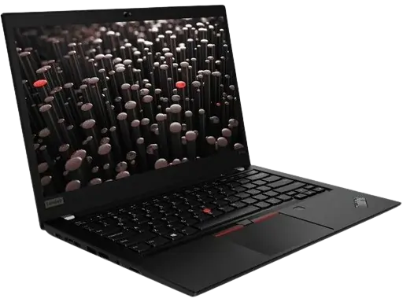
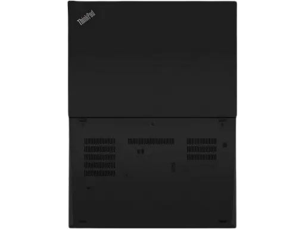
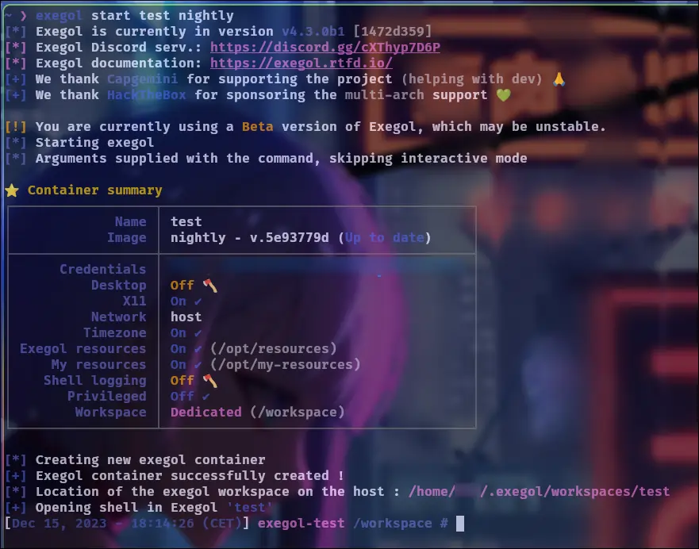
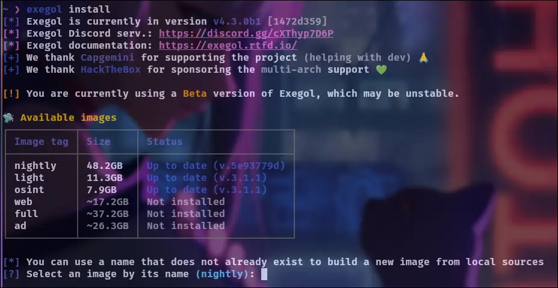
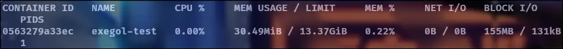
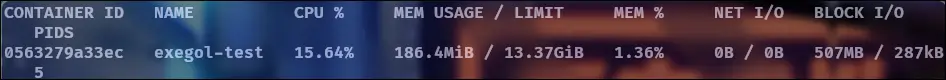
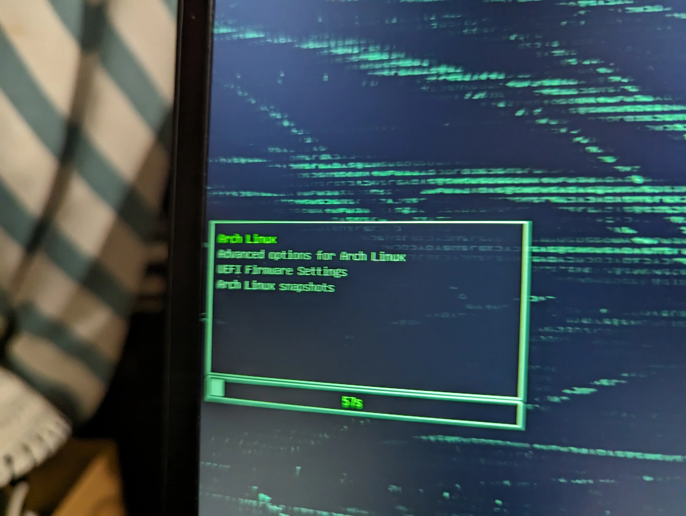
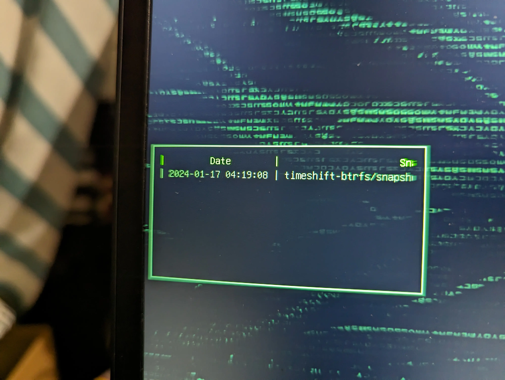

import { Steps, Icon } from '@astrojs/starlight/components';

## PC portable

Avant de nommer le modèle, je voudrais d'abord dire que j'ai fixé quelques limites concernant le budget et les performances de la machine. J'ai besoin d'un ordinateur portable pour l'**école et les événements** et je veux qu'il soit aussi **puissant que possible** (j'ai pensé à un i7 ou Ryzen 7 et 16 Go, ce qui semble bien pour quelques machines virtuelles et du pentesting) pour un budget autour de **600 $** (550 €). J'ai donc cherché un **ordinateur d'occasion** sur des places de marché connues afin d'obtenir un bon rapport qualité/prix. Idéalement, je souhaiterais un **capteur d'empreintes digitales**, une **"cache caméra"** incluse et un **ordinateur léger** (pour les déplacements).

En tant que professionnel de l'informatique depuis quelques années, j'ai remarqué que de nombreuses entreprises (y compris celles où j'ai travaillé) **sont passées de diverses marques aux Lenovo Thinkpads** pour de bonnes raisons telles que le design, le ressenti, le rapport performance/prix, le clavier, les fonctionnalités et surtout la stabilité et le bon support. J'ai eu beaucoup de Thinkpads entre les mains et je les trouve excellents. J'en prendrai donc un pour moi.

Le contexte étant posé, après quelques semaines de recherche, j'en ai trouvé un qui répond parfaitement à mes besoins en parfait état pour 550 $. Le stockage était d'environ **500 Go**, donc j'ai commandé un nouveau SSD nvme de **1 To** en même temps pour 100 $ et j'ai augmenté la mémoire flash à 32 Go pour 60 $.

Voici le modèle précis que j'ai maintenant : **Lenovo ThinkPad P14s Gen 1 - 14"**

Avant | Arrière
--- | ---
 | 

CPU | RAM | ROM
--- | --- | ---
Ryzen 7 PRO 4750U (8 cœurs physiques) | 32 Go 3200Mhz | 1 To Nvme Samsung EVO 775 Pro

Toutes les spécifications peuvent être trouvées [ici](https://www.officexpress.fr/10145925-20y1000qfr-lenovo-thinkpad-p14s-gen-20y1-amd-ryzen-pro-4750u-jusqu-ghz-win-pro-bits-radeon-graphics-ram-256-ssd-tcg-opal-encryption-ips-1920-1080-full-noir-clavier-fran-ais-3540260184357).

**PS** : J'ai pensé aux Thinkpads avec **IntelME** __partiellement__ désactivé et **libreboot** 🕵️, mais minifree.org ne propose pas de machines récentes, j'étais intéressé par le T440p qu'ils ont (littéralement une brique) et il y a un écart significatif entre l'i7 4ème gen et le Ryzen 7 4ème gen du P14S Gen1.

## Système d'exploitation


Si vous souhaitez prendre soin des paquets, des configurations et des scripts vous-même, Arch est la voie à suivre pour garder le contrôle et surtout **APPRENDRE** en faisant et comprendre le fonctionnement des paquets et du GNU/Linux. L'OS est vraiment minimal par défaut, donc **"FAITES-LE VOUS-MÊME"**.

ArchLinux est une distribution en **"Rolling release"**, ce qui signifie que les paquets sont mis à jour vers la dernière version disponible dès qu'elle est prête, donc il n'y a pas de "versions". Il y a aussi le "Arch Wiki", que vous pouvez comparer à la "Sainte Bible" des utilisateurs d'Arch (et oui, c'est plutôt ÉNORME). L'**"utilisateur Arch"** est **LE** gars intelligent (c'est ce que disent les utilisateurs, pas moi 😀, beaucoup d'humour).

L'**"Arch Users Repository"** est un énorme dépôt de paquets fournis par la communauté, il vise à compléter les paquets officiels et permet à tous les développeurs de partager leurs paquets. Gardez à l'esprit que ces paquets sont non officiels.

---

## Environnement de bureau


J'aime les choses simples et modernes. J'ai découvert **Hyprland** il y a quelques années et j'ai décidé de l'essayer sur cet ordinateur portable, j'ai donc cherché des tutoriels sur YouTube pour voir comment les gens l'installaient et le personnalisait. Je suis tombé sur la chaîne [YouTube de Ja Kool.it](https://www.youtube.com/@Ja.KooLit) et j'ai suivi la vidéo "My Hyprland Dots v2 on Debian 13 Linux minimal using netinstaller and Debian-Hyprland install script" [vidéo](https://www.youtube.com/watch?v=Qc4VP9JFh2Y). Cette config **m'a époustouflé**, elle a fonctionné immédiatement, elle était rapide, réactive et agréable à l'œil !

Mais attendez, vous avez dit que vous étiez sur Arch maintenant ! Alors oui, j'ai changé quelques semaines plus tard en raison de **l'insoutenabilité de la version SID de Debian**, du fait que certains **paquets de base ne sont pas maintenus** et que Ja voulait **arrêter le support de ses configurations sur Debian Trixie** pour le moment.

**EDIT**: Je suis passé aux [dotfiles de ML4W](https://github.com/mylinuxforwork/dotfiles), plus à jour, avec une interface graphique pour modifier les paramètres de Hyprland et une meilleure intégration.

## Outillage

Quand vous voulez un **environnement de pentesting**, vous penserez d'abord à une distribution GNU/Linux "Hacking" comme : Kali, Parrot, BlackArch ou AthenaOS. Le gros inconvénient de ces distributions est que vous **n'avez pas le contrôle sur les paquets installés, l'implémentation des projets python** (sont-ils correctement installés dans des venv, avec des liens symboliques pour plus de commodité ?), **les bloatwares** (les paquets installés par défaut que vous n'utiliserez jamais et oui, il y en a beaucoup !), oh, et oui encore **les dépendances python qui peuvent entrer en conflit avec le temps**. Pour conclure, séparer le système d'exploitation des outils utilisés est la voie à suivre.

C'est ici que **Exegol** entre en jeu. Pour ceux qui ne connaissent pas Exegol, c'est un projet FOSS français créé par Shutdown, Dramelac avec le soutien de Capgemini (une grande entreprise technologique) et Hack The Box principalement. L'objectif est de **garder l'OS propre en gérant des conteneurs avec un backend docker**. Un wrapper python s'occupe de toutes les "choses docker" pour vous. Ainsi, dans un conteneur, vous avez : **tous les outils dont vous avez besoin**, vous pouvez y attacher un **VPN** (--vpn config.ovpn), ouvrir un navigateur et des applications avec une interface graphique, attacher des **périphériques USB**, **bureau à distance dans l'environnement du conteneur** (en bêta, avec --desktop) et plus encore (pour toutes les fonctionnalités, consultez [la documentation d'Exegol](https://exegol.readthedocs.io/en/latest/)).

Le tout est rendu aussi simple que de démarrer un conteneur :

```sh
exegol start test nightly
``



Où `test` est le nom du conteneur et `nightly` est l'image Docker sur laquelle il est basé. Vous pouvez télécharger les images Exegol facilement avec :

```sh
exegol install
```

Il vous demandera le nom de l'image que vous souhaitez installer, comme indiqué dans le tableau.



Les tests suivants sont effectués dans un conteneur basé sur l'image nightly :

Consommation en veille | Rustscan avec le paramètre -- -A
:---: | :---:
 | 

Vous pouvez suivre les étapes d'installation et obtenir des conseils ici :  

[Exegol Cheat Sheet](offensive/Exegol_Cheat_Sheet.mdx)

## Avis Important

**Remarque** : Lors de l'installation d'Arch, j'ai rencontré un problème concernant la disposition du clavier dans l'invite de cryptsetup (qui était réglée sur US). Il semble que ce soit un vieux problème pour de nombreux utilisateurs d'Arch. Voici la solution (en chroot après l'installation ou entrez votre mot de passe en pensant à la disposition QWERTY) :

<Steps>

1. Editer le fichier vconsole.conf:

   ```sh
   vim /etc/vconsole.conf
   ```

2. Définir le mappage du clavier en Français:

   ```sh
   KEYMAP=fr-latin9
   ```

3. Puis reconstruire l'image (nécessite les privilèges root):

   ```sh
   mkinitcpio -P
   ```

</Steps>

## Correction de la webcam

La webcam intégrée ne fonctionnait pas, j'ai dû installer le firmware manquant:

```sh
yay -S upd72020x-fw 
```

### IDE

J'utilise vscode et `nvchad` (basé sur neovim) pour naviguer et éditer facilement des fichiers dans les répertoires:

```sh
nvim
```


## Virtualisation

J'utilise QEMU/KVM et un script pour lancer et accéder en RDP automatiquement à une machine virtuelle dédiée à la criminalistique.

<Steps>

1. **Installation de QEMU :** Assurez-vous de mettre à jour votre système avec un `sudo pacman -Syu` AVANT d'installer les dépendances:

   ```sh
   sudo pacman -S qemu virt-manager virt-viewer dnsmasq vde2 bridge-utils openbsd-netcat ebtables iptables libguestfs
   ```

2. Modifiez le fichier /etc/libvirt/libvirtd.conf (Changez les lignes suivantes):

   ```sh
   unix_sock_group = "libvirt"
   unix_sock_rw_perms = "0770"
   ```

3. Ajoutez ensuite votre utilisateur:

   ```sh
   sudo usermod -a -G libvirt $(whoami)
   ```

4. Et créez un groupe:

   ```sh
   newgrp libvirt
   ```

   Source : [blog de christitus](https://christitus.com/setup-qemu-in-archlinux)

</Steps>

Et le script de **RDP sur une VM**:

```sh
#!/bin/bash

# Merci à Stephan Raabe pour le script

if [ -f ~/private/win11-credentials.sh ]; then
	echo "Le fichier des identifiants existe. Utilisation du fichier."
	source ~/private/win11-credentials.sh
else
	win11user="USER"
	win11pass="PASS"
	win11ip="IP"
	win11name="windows11"

	echo "## Préparation de l'accès à distance à votre machine virtuelle Windows ##"

	echo -n "Veuillez entrer le nom de votre machine virtuelle [par défaut : $win11name] : "
	read vmname
	vmname=${vmname:-$win11name}

	echo -n "Veuillez entrer l'IP de votre machine virtuelle [par défaut : $win11ip] : "
	read vmip
	vmip=${vmip:-$win11ip}

	echo -n "Veuillez entrer votre nom d'utilisateur [par défaut : $win11user] : "
	read user
	user=${user:-$win11user}

	echo -n "Veuillez entrer votre mot de passe [par défaut : $win11pass] : "
	read password
	password=${password:-$win11pass}
fi

# echo "Hello, $vmname, $vmip, $user, $password"

tmp=$(virsh --connect qemu:///system list | grep " $vmname " | awk '{ print $3}')

if ([ "x$tmp" == "x" ] || [ "x$tmp" != "xrunning" ]); then
	echo "La machine virtuelle $vmname démarre maintenant... Attente de 30s avant de lancer xfreerdp."
	notify-send "La machine virtuelle $vmname démarre maintenant..." "Attente de 30s avant de lancer xfreerdp."
	virsh --connect qemu:///system start $vmname
	sleep 30
else
	notify-send "La machine virtuelle $vmname est déjà en cours d'exécution." "Lancement de xfreerdp maintenant !"
	echo "Lancement de xfreerdp maintenant..."
fi

if command -v xfreerdp >/dev/null 2>&1; then
	xfreerdp -grab-keyboard /v:$vmip /size:100% /cert-ignore /u:$user /p:$password /d: /dynamic-resolution /gfx-h264:avc444 +gfx-progressive /f &
elif command -v xfreerdp3 >/dev/null 2>&1; then
	xfreerdp3 -v:$vmip -u:$user -p:$password -d: -dynamic-resolution /cert:ignore /f /gfx:AVC444 &
else
	echo "'xfreerdp' ou 'xfreerdp3' commande introuvable."
fi
```

## Gestion des paquets

**Pacman** s'occupe des paquets core/extra, **yay** de ceux d'**AUR**. Une fois par mois, je nettoie les paquets orphelins et le cache :

```sh
sudo pacman -Rns $(pacman -Qtdq) && yay -Scc
```

## Configuration des snapshots automatiques

Il est conseillé d'établir un "PRA" pour le système d'exploitation lors de l'installation initiale. Les mises à jour peuvent parfois entrer en conflit ou perturber les paquets système, entraînant des problèmes de démarrage/de connexion. J'ai donc utilisé timeshift pour créer des instantanés quotidiens, conservant les trois derniers jours. De plus, j'ai intégré le package timeshift-autosnap AUR pour générer automatiquement un instantané de timeshift lors des mises à jour initiées via les hooks pacman.

Ensuite, j'ai configuré Grub pour rendre ces snapshots accessibles, permettant un démarrage direct dans ceux-ci. J'ai suivi ce [tutoriel](https://discovery.endeavouros.com/encrypted-installation/btrfs-with-timeshift-snapshots-on-the-grub-menu/2022/02/).

Menu de démarrage Grub | Liste des snapshots
:---: | :---:
 | 