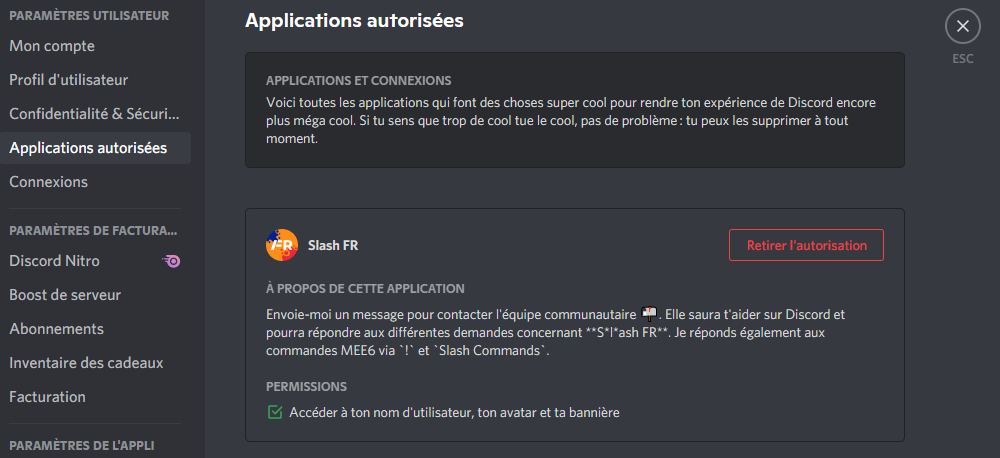

import { LinkCard, CardGrid } from '@astrojs/starlight/components';

Révisions

Date | Changes
--- | ---
15/09/2023 | Révisions
21/08/2023 | Révisions 
20/08/2023 | Révisions 
18/08/2023 | Initial push 

 Avez-vous déjà entendu parler de **"DOX/DOXXING/SWAT"** ? **Comprendre le fonctionnement de ces pratiques et vous en protéger !** 

➡️ Le fait de "DOX" est de **partager des informations personnelles** sur une personne **sans son consentement**, dans le but de nuire à celle-ci.

 Le principe technique qui se cache derrière ce terme est l'**OSINT**. L'**Open Source Intelligence** (OSINT) est une pratique de **reconnaissance légale** visant à **récolter des informations sur une entité physique ou morale** à partir de **sources ouvertes**. Elle est utilisée par les professionnels de la cybersécurité, les agences gouvernementales, les autorités... Ce n'est pas une niche mais une pratique très puissante et très largement utilisée.  

  

- Les sites/applications et réseaux sociaux (vos **comptes** sur ces derniers) et donc par extension, le contenu que vous partagez sur ceux-ci.
- Les moteurs de recherche (Google, Bing, Duckduckgo...).
- Les bases de données leaks (services/sites compromis dont des informations ont fuité en ligne), sort du scope de l'OSINT (détention illégale de données).
- Les pages blanches/jaunes et autres annuaires de recensement.
- Les sites et outils spécialisés (Mr.Holmes, Maigret, Holehe, Maltego, whatsmyname.app, intelx.io...), qui facilitent la récole d'informations en un point à partir de sources multiples.

 Comme vous l'avez compris l'OSINT est un **processus d'investigation** à la base **PASSIF** (ont exclu ici le phishing, "token grab" ou toute action dites "active"). C’est-à-dire que la cible ne sera pas informée de ce processus, ce qui le rend encore plus dangereux.  

Cet article vise à donner des éléments pour **prévenir la récolte d'informations** et **maîtriser l'exposition de votre profil Discord**.  

✅ Pour faire court, le gros du travail peut être fais en utilisant une fausse identité, adresse mail, numéro de téléphone et en partageant le minimum d'informations possibles, pour réduire votre empreinte numérique au moins sur Discord.

➡️ Il existe différent points d'entrée :  

- Le pseudo.
- Tous vos anciens pseudos.
- La biographie.
- La photo de profil.
- Les comptes liés (réseaux sociaux, Spotify, jeux...).
- L'ID utilisateur (accessible depuis les developer tools).  
- Le mail utilisé lors de l'inscription sur Discord.  

:::note[Date de création du compte]
La date de création du compte ainsi que la date à laquelle vous avez rejoint un serveur, donnent des informations sur la récence de votre compte, donc par extension des informations vous concernant.
:::

**Le bon sens est tout aussi important** :

- Ne partagez pas d'information (oral, écrit, partage d'écran et webcam) à caractère personnel sur Discord.  
⚠️ **À PERSONNE** (ni amis, ni "connaissances", ni même à votre famille ou collègues) :::  

- Ne scannez aucun **qrcode**, surtout si ce dernier vous est proposé à des fins de vérification sur un serveur.

:::danger[Partager des informations sensibles sur Discord]
Si vous voulez malgré tout partager une information sensible sur Discord, mais de façon éphémère et sans traces, utilisez un service de partage de texte en ligne, chiffré de bout en bout, avec un mot de passe et une expiration comme : <a href="https://privatebin.net" target="_blank">PrivateBin</a>. De cette manière l'accès à la donnée n'est autorisé qu’une seule fois et/ou nécessite un mot de passe et expire après une date définie. Pour les fichiers, vous pouvez utiliser un service comme <a href="https://proton.me/fr/drive" target="_blank">Protondrive</a> (nécessite un compte et est limité à 1Go gratuit) ou <a href="https://www.swisstransfer.com/fr-fr" target="_blank">Swisstransfer</a> (ne nécessite pas de compte et est limité à 50Go gratuits).
:::

---

## ZONE 1 (facile)

:::tip[Info]
Cette zone est destinée aux néophytes qui souhaiteraient adopter quelques bonnes pratiques (le minimum vital) rapidement.
:::

- Ne pas utiliser le même pseudo sur toutes vos plateformes, privilégiez un pseudo unique à Discord.
- Limitez-vous au strict nécessaire dans votre biographie, pas de <a href="https://linktr.ee" target="_blank">Linktr.ee</a> ou de liens vers vos réseaux sociaux.
- Évitez les tokens grab, cookie stealer ou iplogger : **ne cliquez sur AUCIN LIEN dans Discord** (même youtube ! copiez/collez ou réécrivez le titre à la place), ouvrez-le dans un autre navigateur (si possible prévu à cet effet (sandbox ou mieux un <a href="https://www.browserling.com" target="_blank">service de sandbox en ligne</a>).
- Ne liez pas vos comptes de jeux et sites à Discord ! Toutes applications liées à votre profil, comme des bots ou des comptes verront les informations de celui-ci (notamment les comptes liés, ce qui peut faire fuiter votre profil, mail, nom/prénom... (si utilisez sur les services liés)).

https://youtu.be/-lEg13LKJxE?si=VfgjvBky_GsWTfqC&t=234

~~Si vous devez lier un ou plusieurs comptes, décochez l'affichage sur votre profil :~~   

:::caution[Discord à affiché vos comptes (même si ceux-ci sont cachés) !]
Discord à affiché tous les comptes liés à un profil, indépendamment de la configuration (caché ou non dans les paramètres), source: cet <a target="blank" href="https://discordpreviews.com/private-connections-bug">article</a> et ce <a target="blank" href="https://twitter.com/panley01/status/1692036545539101049">Thread X</a> :  

https://twitter.com/panley01/status/1692036545539101049

 Ne liez tous simplement pas vos comptes à Discord !
:::

- N'utilisez aucun selfbot, injection client (betterdiscord like) ou tout autre modifications du client.
- Ne vous connectez jamais à un site qui propose de vous connecter avec Discord (dans le cas où la base de données du site fuite, des informations tels que : votre pseudo, ID Discord, email, hash de mot de passe... seront disponibles en ligne. Un exemple récent avec <a target="blank" href="https://web.archive.org/web/20230823102446/https://discord.io">discord.io</a>).

Si vous souhaitez toutefois utiliser cette fonctionnalité sur les sites qui la propose, créez-vous un autre compte prévu à cet effet en suivant les exigences de la [zone 3](#zone-3-avancé).

---

## ZONE 2 (intermédiaire)

:::caution[Info]
Cette zone s'aditionne à la précédente et **inclut différents changements de paramétrages** dans Discord.
:::

- Si vous partagez votre écran, activez le mode streameur :

- S'assurer que **"Filtrer tous les messages privés"** (spam) soit activé :

- S'assurer que **"Autoriser les messages privés venant des membres du serveur"** et **"Autoriser les demandes de messages en provenance des membres du serveur que tu pourrais ne pas connaître"** soient désactivés :

- Vérifiez l'accès des applications/bots/comptes à vos informations, à savoir : quelles informations peuvent ils récolter, quelles sont les permissions qui leur sont accordés et si possible, retirez toutes les autorisations.

---

## ZONE 3 (avancé)

:::danger[Info]
Cette zone s'additionne aux précédentes et présente des **concepts avancés** pour créer un compte Discord sans données personnelles.
:::

- Recréez un compte avec une fausse identité <a href="https://www.fakenamegenerator.com" target="_blank">fakenamegenerator</a> (par exemple) pallie le potentiel risque de fuite de données de l'ancien compte.
- Utilisez un **email unique** pour Discord (alias recommandés ex. <a href="https://simplelogin.io" target="_blank">SimpleLogin</a> ) 

<CardGrid>
  <LinkCard
    title="Consulter l'article à ce sujet"
    href="../alias_mail"
  />
</CardGrid>

- Il y a deja eu des leaks sur des plateformes tierces majeures :  

https://twitter.com/panley01/status/1691184136889708545

- Utilisez un mot de passe respectant l es éxigences de l'ANSSI (complexité, stockage et cycles de vie, gestionnaire de mot de passe fortement recommandé (ex. [KeePass](https://keepassxc.org) )) et activez **l'authentification multifacteurs** :

<CardGrid>
  <LinkCard
    title="Voir la doc"
    href="https://www.ssi.gouv.fr/guide/recommandations-relatives-a-lauthentification-multifacteur-et-aux-mots-de-passe/"
  />
</CardGrid>

- Pour la 2FA utilisez un **numéro de téléphone unique à Discord** (ex. <a href="https://www.onoff.app" target="_blank">OnOff</a> ).

:::note
Dans le cas où vous appliquez toutes ces mesures, le seul point d'entrée pour vous atteindre est alors en dehors de Discord. C'est d'ailleurs l'un des moyens privilégié pour récolter des informations sur vous, vous faire installer un programme malveillant ou vous subtiliser un cookie de session (comme votre token Discord).  

L'ensemble de ces recommandations vous sont proposées à titre suggestif. Vous pouvez ne pas en appliquer certaines, dû à votre niveau de sécurité voulu. Dans ce cas, il est important de comprendre le risque et d'en accepter les conséquences potentielles.
:::
