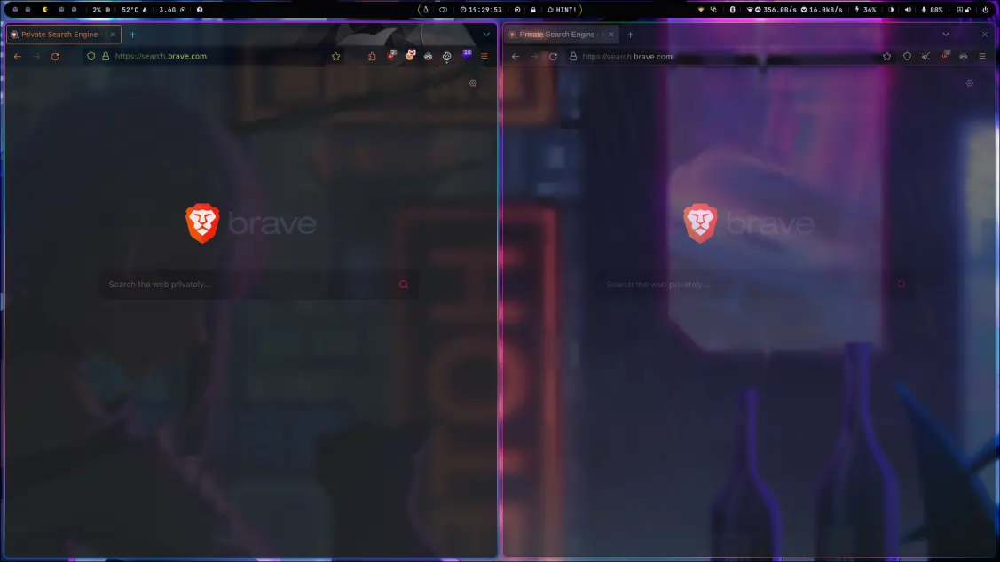

import { Steps, Icon } from '@astrojs/starlight/components';

:::caution[Cette documentation est en cours d'écriture]
Il pourrait il y a avoir quelques erreurs.  
Si vous en remarquez une, contactez-moi [ici](mailto:contactit.yarka@slmail.me)
::: 

Exegol Cheat Sheet est un condensé des commandes et concepts pertinents à mon sens sur le projet exegol.  

<Steps>

1. Installation

   Exegol repose sous docker, si il n'est pas installé sur votre système, installez le avec cette commande :

   ```sh
   curl -fsSL "https://get.docker.com/" -o get-docker.sh && sh get-docker.sh
   ```
   
   <Steps>

   1. Ajouter l'utilisateur au groupe docker

      Autoriser l'usage de docker et donc exegol via l'utilisateur actuel sans élévations de privilèges :

      ```sh
      sudo usermod -aG docker $(id -u -n) && newgrp docker
      ```

   2. Installer exegol avec PIPX

      La manière la plus simple et propre d'installer le projet python exegol (en version stable main branch) :

      > Requiert pipx, l'installer au besoin `sudo apt install pipx`

      ```sh
      pipx install exegol
      ```

      :::note
      pipx va automatiquement créer les symlinks du venv python pour que l'appel du binaire se fasse sans problèmes.  
      La <a href="[https://privatebin.net](https://peps.python.org/pep-0668/)" target="_blank">PEP668</a>introduit récemment par les distributions GNU/Linux majeures n'autorise pas l'installation de packages python côté système notamment avec **pip**.  
      Pour une bonne raison, puisque beaucoup de projets python ont été développés sur une version spécifique de python avec des versions de dépendances spécifiques, généralement installés avec `pip install -r requirments.txt`.  

      Ce qui peut causer d'importants problèmes de dépendances entre les projets c’est pourquoi il **FAUT** isoler les environnements python (idéalement) de chaque projet, sois par la création de venv ou par pipx qui rend l'opération rapide et simple pour l'utilisateur. Raison pour laquelle dans chaque projet python installé dans les images dockers proposées par exegol vous trouverez un venv associé.
      ::: 

   3. Ajouter l'autocompletion

      Ajouter dans le .bashrc ou .zshrc :

      ```sh ~/.bashrc
      eval "$(register-python-argcomplete --no-defaults exegol)"
      ```

   4. Installer une image docker d'exegol 

      ```sh
      exegol install nightly
      ```

   </Steps>

2. Upgrade exegol

   ```sh
   pipx upgrade exegol
   ```

3. Les ressource offline

   Les ressources offline sont stockées dans `/opt/resources` qui est partagé entre le système hôte et les containers docker.
   Dans ce répertoire, sont stockés par défaut des outils utiles pour le pentest comme :
   <Icon name="right-arrow" />winpeas
   <Icon name="right-arrow" />linpeas
   <Icon name="right-arrow" />...

   L'objectif étant de gagner du temps et de faciliter le transfert vers une cible.

4. Usage

   <Icon name="right-arrow" />Install an image : `exegol install`  
   <Icon name="right-arrow" />Create/start/enter a container : `exegol start`  
   <Icon name="right-arrow" />Show info on containers and images : `exegol info`  
   <Icon name="right-arrow" />Stop a container : `exegol stop`  
   <Icon name="right-arrow" />Remove a container : `exegol remove`  
   <Icon name="right-arrow" />Uninstall an image : `exegol uninstall`  
   <Icon name="right-arrow" />Get help and advanced usage : `exegol --help`  
   <Icon name="right-arrow" />Help and examples can be obtained for each action directly from the wrapper with the following command: `exegol <action> -h` (action: install/start/stop/etc.).

5. Installer exegol en version beta

   La version beta (dev branch) d'exegol propose plusieurs fonctionnalités comme la plus attendue le **remote desktop** (en web) sur un container.  
   Si vous avez exegol installé, 

   <Steps>

   1. Désinstallez la version standard :

      ```sh
      pipx uninstall exegol
      ```

   2. Il est nécessaire d'installer exegol depuis le repo github :

      ```sh
      git clone "https://github.com/ThePorgs/Exegol"
      ```

   3. Installer les dépendances python :

      ```sh
      python3 -m pip install --user --requirement "Exegol/requirements.txt" --break-system-packages
      ```

      > Ici l'option `--break-system-packages` ignore la **PEP668**.

   4. Ajouter exegol au PATH :

      :::caution[Nettoyage]
      Si vous avez désinstallé une précédente version d'exegol auparavant, supprimez l'ancien fichier : `sudo rm -f /usr/local/bin/exegol`
      :::

      ```sh
      sudo ln -s "$(pwd)/Exegol/exegol.py" "/usr/local/bin/exegol"
      ```
   5. Mettre à jour vers la version beta ou dev branch :

      ```sh
      exegol update -v
      ```

   6. Il vous sera demandé de choisir la version de votre branche dans le repo git, choisissez **dev**.  
   
   7. Vous devrez par la suite mettre à jour les dépendances python du projet ( la commande s'affichera dans votre terminal).
   
   </Steps>

6. Lancer un container avec remote desktop en accès web 

   ```sh
   exegol start test nightly --desktop
   ```

7. Fix Evil-WinRM (Déprécié, corrigé)

   Exegol a un problème avec l'implémentation d'openssl lors de l'exécution d'**Evil-WinRM**. Pour corriger cela, nous devons modifier le fichier `openssl.cnf` (rechercher `[openssl_init]` et remplacer par la configuration ci-dessous) :

   ```sh title="/etc/ssl/openssl.cnf"
   [openssl_init]
   providers = provider_sect

   # List of providers to load
   [provider_sect]
   default = default_sect
   legacy = legacy_sect

   [default_sect]
   activate = 1
   [legacy_sect]
   activate = 1
   ```
8. Tips

   Depuis que j'utilise principalement Firefox et qu'il est le navigateur par défaut dans les containers, il m'arrive parfois de télécharger une chose sur mon hôte dans l'action et au lieu de cela, cela va dans le container. Comme j'utilise Hyprland, les titres des fenêtres n'apparaissent plus. Pour résoudre cela, je n'ai pas ramené les titres, mais j'ai configuré exegol pour **installer un thème firefox dans chaque container**. De cette façon, les deux fenêtres sont facilement distinguables comme le montre l'image ci-dessous.

   

   J'ai ajouté également **uBlock Origin** à tous les containers pour bloquer les annonces (cookies prompts, publicités, trackers...) en éditant le fichier suivant :

   ```sh title="~/.exegol/my-resources/setup/firefox/addons.txt"
   # This file can be used to install addons on the Firefox instance of Exegol.
   # The download links of the addons to be installed can be listed in this file (ie: https://addons.mozilla.org/fr/firefox/addon/foxyproxy-standard/).
   # All addons listed below will be downloaded and installed automatically when creating a new Exegol container.
   https://addons.mozilla.org/fr/firefox/addon/ublock-origin/
   https://addons.mozilla.org/fr/firefox/addon/rainbow-sparkle-animated-theme/
   ```

   Quelques modifications dans l'historique:

   ```sh title="~/.exegol/my-resources/setup/zsh/history"
   burpsuite &> /dev/null &
   python3 -m http.server 80
   ```

   Et des alias personnels:

   ```sh titl="~/.exegol/my-resources/setup/zsh/aliases"
   alias http='python3 -m http.server 80'
   alias tun0='ip a sh dev tun0 | grep -oP "(?:[0-9]{1,3}\.){3}[0-9]{1,3}" | tr -d "\n" | xclip -sel c; tun0ip=$(xsel -ob); echo "\033[1;32m[+]\033[0m Successfully copied \033[1;32m$tun0ip\033[0m (tun0) to clipboard !"'
   ```
   
</Steps>

:::caution[Montage NFS]
Si vous souhaitez monter des partages NFS dans un conteneur Exegol, vous devez le démarrer avec l'option --privileged.
:::

> Des screenshots viendront par la suite pour chaque étape :)