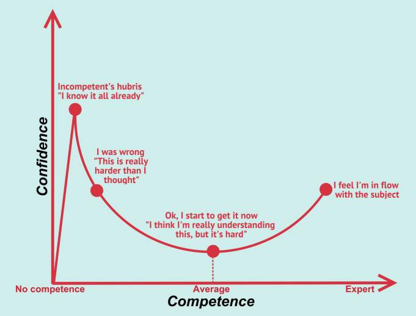

To put it briefly and figuratively, the Dunning-Kruger effect is a type of cognitive bias where people believe they are more "intelligent" and "capable" than they actually are. 

In other words, individuals with a low level of competence lack the necessary skills to recognize their own incompetence. This combination of poor self-awareness and low cognitive ability leads these individuals to overestimate their capabilities.

---

### Introduction

In the field of cybersecurity, accurately understanding one's own skills is crucial for effective protection of information systems. The Dunning-Kruger effect, named after psychologists David Dunning and Justin Kruger who identified it, highlights a **behavioral dynamic** where individuals who are poorly informed or inexperienced in a field tend to overestimate their skills.

### Overestimation and Vulnerabilities

**Malicious actors** often exploit this overestimation to carry out successful attacks. **An individual who overestimates their cybersecurity skills may neglect basic practices**, creating vulnerabilities that can be exploited by attackers.

### Underestimation and Untapped Potential

Conversely, experienced cybersecurity experts may sometimes underestimate their skills, hesitating to adopt new technologies or practices due to some fear. This can lead to untapped potential and stagnation of the information system over time.

### Managing the Dunning-Kruger Effect

Managing the Dunning-Kruger effect requires a balanced approach. Cybersecurity teams should encourage ongoing training and **awareness of actual skills**. Implementing mentorship and knowledge-sharing programs can help bridge the gap between perceived and actual skills.

The key to overcoming the Dunning-Kruger effect in cybersecurity is what researchers call metacognition, or reflection on one's own thinking. It is important to ask questions, be mindful of assumptions, and seek knowledge. Confidence may decrease, but competence will increase.

### Conclusion

In conclusion, understanding the Dunning-Kruger effect in cybersecurity is essential for enhancing security posture. Awareness of actual skills, combined with continuous education, can help mitigate risks associated with overestimation and underestimation. Cybersecurity, as a constantly evolving discipline, demands ongoing intellectual humility.

*Sources* : 

- **Dunning, D., & Kruger, J. (1999).** Unskilled and unaware of it: How difficulties in recognizing one's own incompetence lead to inflated self-assessments.
- **Smith, R. D. (2018).** Cybersecurity and the Dunning-Kruger Effect: A Metacognitive Perspective.
- **OpenAI.** ChatGPT.
- **The Dunning-Kruger Effect and Why It Convolutes Cybersecurity.** https://truedigitalsecurity.com/blog/dunning-kruger-cybersecurity.
- **Microsoft.** Co-pilot
- **verywellmind.com** https://www.verywellmind.com/an-overview-of-the-dunning-kruger-effect-4160740