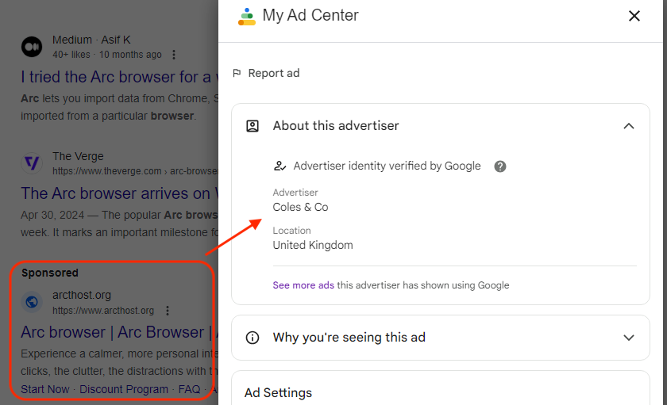
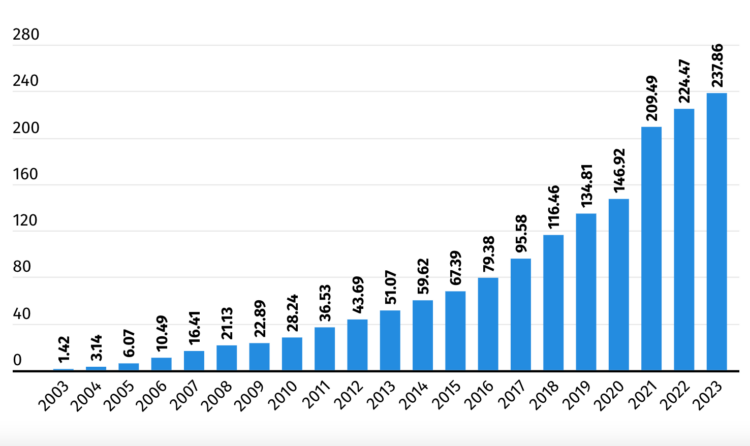

Google Ads has become a serious problem for cybersecurity, serving as a **distribution vector** for various types of **malware**. This alarming trend exploits users' trust in Google's ecosystem (and advertising platform) to spread malicious software and compromise systems. A recent example perfectly illustrates this threat. In June 2024, a new strain of malware targeting **Mac** was discovered. These malicious ads mimicked **Arc**, a popular browser on macOS, redirecting users to a counterfeit website:

Once downloaded and installed, the malware transmitted the user's data (an infostealer called Poseidon). **This is not an isolated incident**; attackers regularly use Google Ads to spread various types of malware through deceptive sites. These sites imitate popular legitimate software such as **VLC**, **7-Zip**, and **CCleaner**, and they pay **Google** to be ranked above other results (example for Open Broadcaster Software):

The threat is particularly insidious because it exploits the **perceived legitimacy of Google** and, by extension, its **Ads** module. Users, accustomed to trusting Google's **sponsored results**, may be less vigilant when encountering these malicious ads.

:::note[Personal Experience]
Personally, a company where I interned experienced a **crisis** (ransomware-related) due to a **ransomnote** displayed full screen on an employee's computer. I repeatedly recommended a **browser-based ad blocker**, but the management believed that **firewalls** would suffice (considering they were new and freshly configured at the time, I won’t go into details, but domain blocklists are clearly not enough…). In addition to generating stress and temporarily halting the employee's work, the company had to hire a **forensics specialist** to trace the origin of this "attack," which turned out to be a **site mimicking a full-screen ransomnote**. The user accessed the site due to **sponsored links** at the top of the Google page (which are blocked by default by ad blockers).
:::

Files downloaded from these malicious sites are often **password-protected zip archives**, allowing them to **bypass antivirus scans** on the platforms where they are hosted.

As always, to protect yourself, it is essential to **download software only from official sources** and remain cautious of unusual installation instructions. Users should be aware that even legitimate-looking ads can potentially host **malicious content**. While Google claims to take action against malicious advertisers once informed, the responsibility for identifying and removing these threats often falls on **end-user antivirus products** or other **security solutions**. This situation highlights the need for increased user vigilance and improved **detection and prevention mechanisms** by Google. Let’s not forget that advertising revenue is significant for the company:

This point suggests that at best, the company turns a blind eye to generate **higher revenues**, including a package of **malicious actors**, or at worst, **neglects security checks**...

https://youtu.be/c5fAiwVvr6s

https://youtu.be/kgckm2DGOOY

**- Sources :**

[https://arstechnica.com/security/2024/06/mac-info-stealer-malware-distributed-through-google-ads/](https://arstechnica.com/security/2024/06/mac-info-stealer-malware-distributed-through-google-ads/)  
[https://latesthackingnews.com/2023/01/05/new-malware-campaign-spreads-by-exploiting-google-ads/](https://latesthackingnews.com/2023/01/05/new-malware-campaign-spreads-by-exploiting-google-ads/)  
[https://www.schneier.com/blog/archives/2023/02/malware-delivered-through-google-search.html](https://www.schneier.com/blog/archives/2023/02/malware-delivered-through-google-search.html)  
[https://www.bleepingcomputer.com/news/security/ransomware-access-brokers-use-google-ads-to-breach-your-network/](https://www.bleepingcomputer.com/news/security/ransomware-access-brokers-use-google-ads-to-breach-your-network/)  
[https://www.bleepingcomputer.com/news/security/hackers-push-malware-via-google-search-ads-for-vlc-7-zip-ccleaner/](https://www.bleepingcomputer.com/news/security/hackers-push-malware-via-google-search-ads-for-vlc-7-zip-ccleaner/)

**- References :**

[https://www.bleepingcomputer.com/news/security/google-ads-push-fake-google-authenticator-site-installing-malware/](https://www.bleepingcomputer.com/news/security/google-ads-push-fake-google-authenticator-site-installing-malware/)  
[https://www.bleepingcomputer.com/tag/google-ads/](https://www.bleepingcomputer.com/tag/google-ads/)  
[https://www.malwarebytes.com/blog/scams/2024/08/dozens-of-google-products-targeted-by-scammers-via-malicious-search-ads](https://www.malwarebytes.com/blog/scams/2024/08/dozens-of-google-products-targeted-by-scammers-via-malicious-search-ads)
