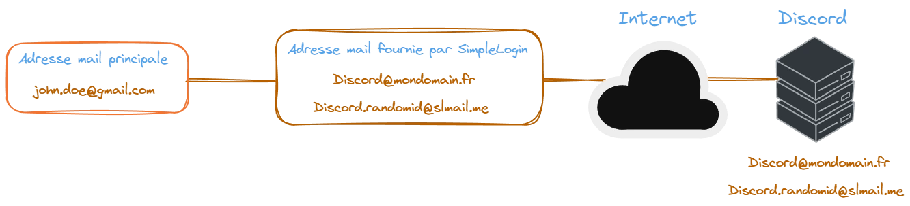
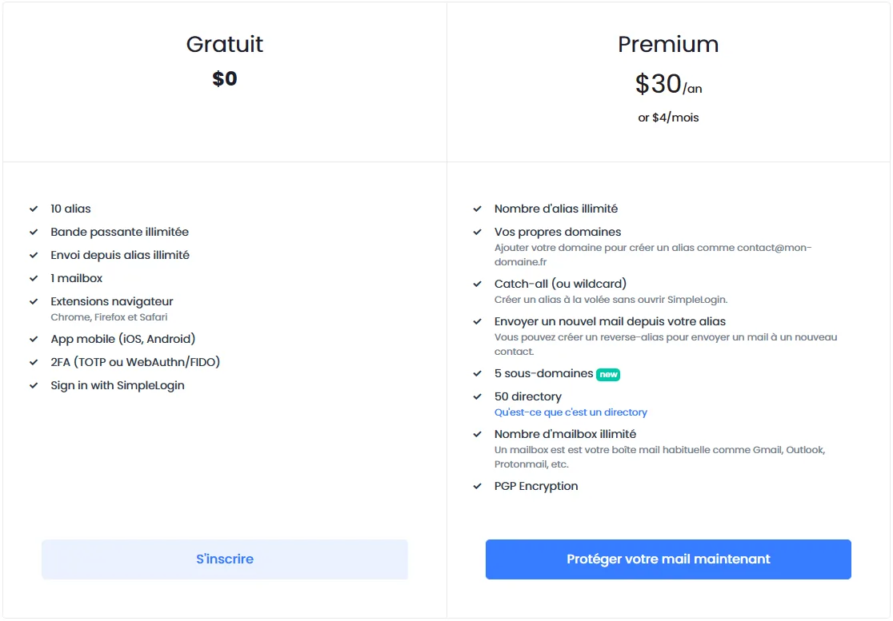
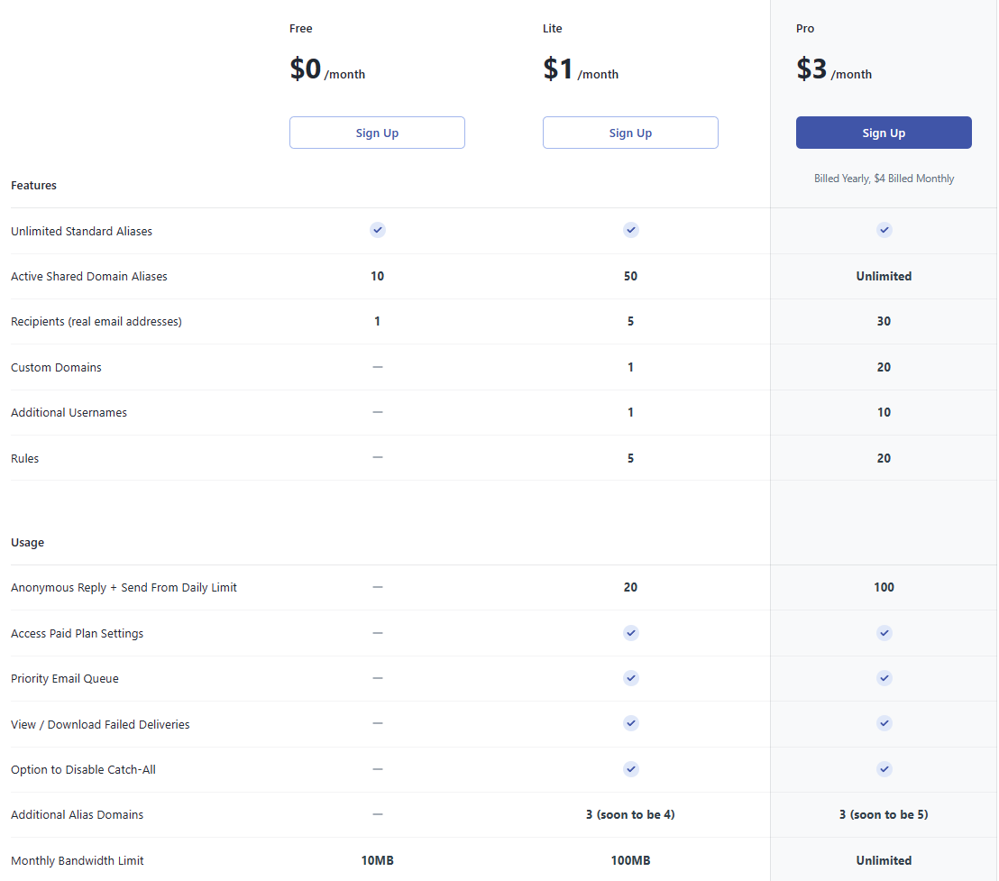
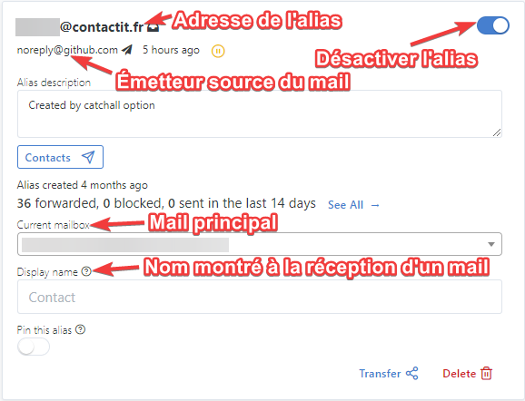

<details>
<summary>Revisions</summary>
Date | Changes
--- | ---
15/06/2023 | Revisions
21/08/2023 | Revisions 
20/08/2023 | Initial push
</details>

:::danger[Info]
Email aliases with the '+' symbol will not be covered in this article, as many websites block the use of special characters in email addresses. Moreover, even if you add a plus to the address, it remains visible.
::: 

An email alias works similarly to email forwarding. An intermediary is responsible for receiving the email and forwarding it to the recipient.  

<a href="https//addy.io" target="_blank">Addy (formerly AnonAddy)</a>. These services offer 15 email addresses (aliases) for their respective free plans. This means that instead of giving your main email address to a service, person, or during registration, you provide a unique address generated by the service in question. This effectively separates your identities linked to your email addresses, as you can choose the beginning of the generated email address and also set any contact name (which will be displayed when an email is received from you).  


```d2 sketch pad=50 title="Logical diagram of how an email alias works" --dark-theme 200 input.d2
direction: right

Gmail."jdoe@gmail.com" -> Simplelogin."github.yarka@slmail.me" -> Github -> Simplelogin."github.yarka@slmail.me" -> Gmail."jdoe@gmail.com": {style.animated: true}
```



---

## Advantages

- In the event of a service leak, the main email does not get leaked.
- Your main email address remains unknown to your recipients. You have multiple addresses that are easy to manage.  
- Ability to deactivate or delete an address in case of spam.  
- Support for catch-all functionality for your domain.  
- Ability to forward emails received by an alias to multiple email addresses automatically (mailing list).  
- Easy alias generation with the extension.  
- Integration and email generation included in ProtonPass (SimpleLogin).

---

## Disadvantages

- Dependence on the service for the emails used.  
- Trust in the service for mail transport.  
- Email limits, bandwidth, and quota restrictions for sending/receiving (Addy.io).  
- Attachment size limit of 25 MB (if you exceed this file size, use a file-sharing service like <a href="https://www.swisstransfer.com" target="_blank">SwissTransfer</a>).

<details>
<summary>Do email addresses continue to work after my subscription ends?</summary>

SimpleLogin continues to offer its services even after your subscription ends:  

>When your subscription ends, all aliases you created continue working normally, both on receiving and sending emails. Concretely:
>- All aliases/domains/directories/mailboxes you have created are kept and continue working normally.
>- You cannot create new aliases if you exceed the free plan limit, i.e. have more than 10 aliases.
>- As features like catch-all or directory allow you to create aliases on-the-fly, those aliases cannot be automatically created if you have more than >10 aliases.
>- You cannot add new domain, directory, or mailbox.  
>
>For example, if you have 100 aliases by the time your subscription ends, these 100 aliases will continue receiving and sending emails normally. You >cannot, however, create new aliases.

</details>

## Pricing and Features

SimpleLogin | Addy
:---: | :---:
 | 

SimpleLogin offers more features compared to its competitors. Additionally, the service was acquired by Proton and is free (with premium) for subscribers.



---