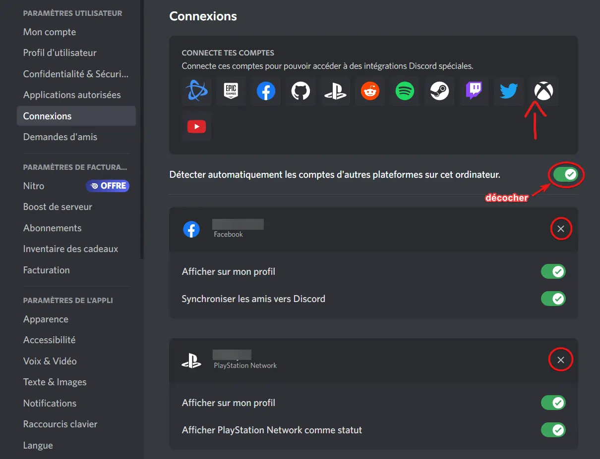
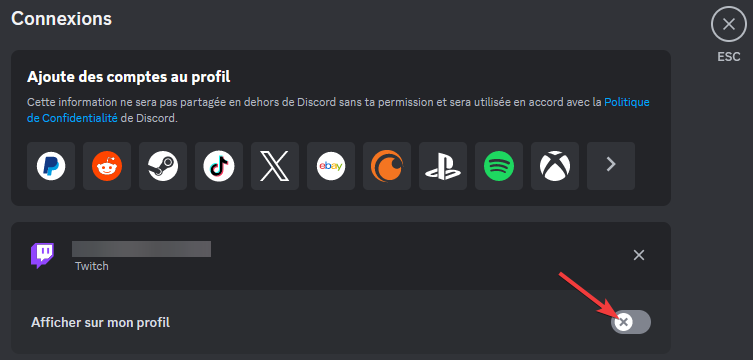
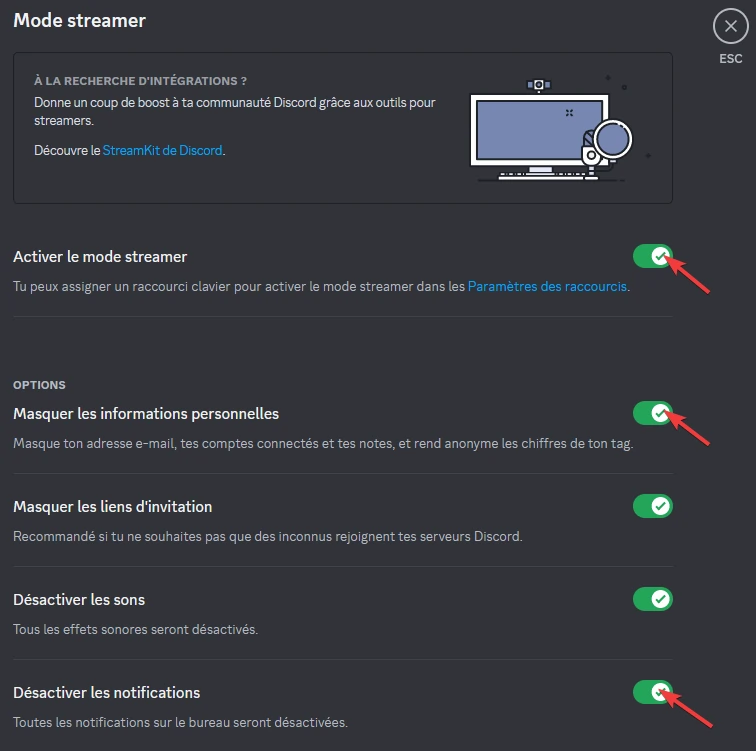
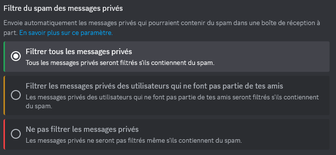
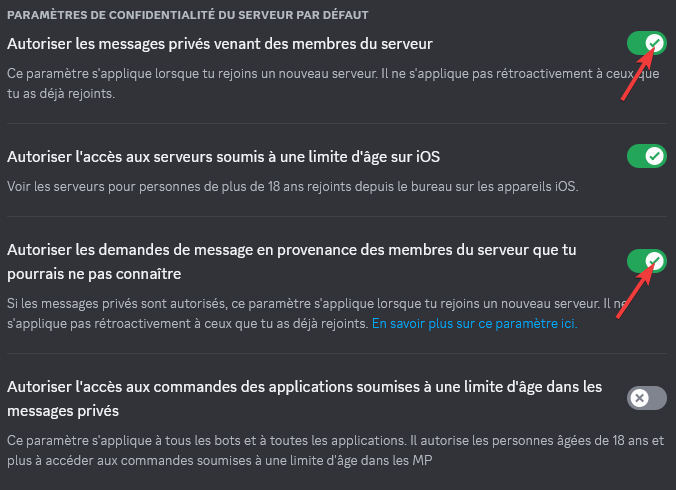
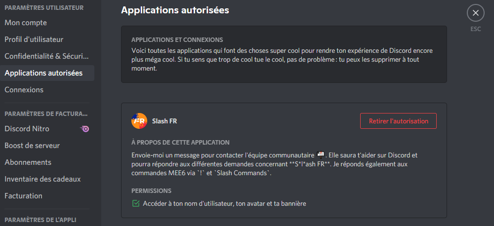

import { LinkCard, CardGrid } from '@astrojs/starlight/components';

Revisions

Date | Changes
--- | ---
15/09/2023 | Revisions
21/08/2023 | Revisions 
20/08/2023 | Revisions 
18/08/2023 | Initial push 

Have you ever heard of **"DOX/DOXXING/SWAT"**? **Understand how these practices work and protect yourself!**

➡️ The act of "DOX" involves **sharing personal information** about someone **without their consent**, with the intent to harm them.

The technical principle behind this term is **OSINT**. **Open Source Intelligence** (OSINT) is a **legal reconnaissance** practice aimed at **gathering information about a physical or legal entity** from **open sources**. It is used by cybersecurity professionals, government agencies, authorities... It’s not niche but a very powerful and widely used practice.

- Websites/apps and social networks (your **accounts** on these platforms) and, by extension, the content you share on them.
- Search engines (Google, Bing, Duckduckgo...).
- Leak databases (services/sites compromised where information has leaked online), which fall outside the scope of OSINT (illegal data possession).
- White/Yellow pages and other directory listings.
- Specialized sites and tools (Mr.Holmes, Maigret, Holehe, Maltego, whatsmyname.app, intelx.io...) that facilitate the collection of information from multiple sources in one place.

As you’ve understood, OSINT is an **investigative process** that is primarily **PASSIVE** (excluding phishing, "token grab," or any so-called "active" actions). This means the target will not be informed of this process, making it even more dangerous.

This article aims to provide elements to **prevent information gathering** and **control the exposure of your Discord profile**.

✅ In short, most of the work can be done by using a fake identity, email address, phone number, and sharing the minimum amount of information possible to reduce your digital footprint, at least on Discord.

➡️ There are different entry points:

- Username.
- All your previous usernames.
- Biography.
- Profile picture.
- Linked accounts (social networks, Spotify, games...).
- User ID (accessible via developer tools).
- The email used during Discord registration.

:::note[Account Creation Date]
The account creation date and the date you joined a server provide information about how recent your account is, and by extension, information about you.
:::

**Common sense is just as important**:

- Do not share any personal information (spoken, written, screen share, or webcam) on Discord.
⚠️ **WITH NO ONE** (not with friends, "acquaintances," not even with your family or colleagues) :::

- Do not scan any **QR code**, especially if it’s offered for verification purposes on a server.

:::danger[Sharing Sensitive Information on Discord]
If you still want to share sensitive information on Discord, but in a temporary and trace-free manner, use an online text-sharing service that is end-to-end encrypted, password-protected, and has an expiration date like: <a href="https://privatebin.net" target="_blank">PrivateBin</a>. This way, the data can only be accessed once and/or requires a password and expires after a set date. For files, you can use a service like <a href="https://proton.me/fr/drive" target="_blank">Protondrive</a> (requires an account and is limited to 1GB for free) or <a href="https://www.swisstransfer.com/fr-fr" target="_blank">Swisstransfer</a> (no account required and limited to 50GB for free).
:::

---

## ℹ️ ZONE 1 (Easy)

:::tip[Info]
This zone is intended for beginners who want to quickly adopt some good practices (the essential minimum).
:::

- Don’t use the same username on all your platforms; prefer a unique username for Discord.
- Limit yourself to the bare minimum in your biography, no <a href="https://linktr.ee" target="_blank">Linktr.ee</a> or links to your social networks.
- Avoid token grabs, cookie stealers, or IP loggers: **do not click on ANY LINK in Discord** (even YouTube! copy/paste or rewrite the title instead), open it in another browser (if possible, one specifically set up for this purpose—sandboxed or, better yet, use an <a href="https://www.browserling.com" target="_blank">online sandbox service</a>).
- Don’t link your gaming and site accounts to Discord! All applications linked to your profile, such as bots or accounts, will see information about it (especially linked accounts, which can leak your profile, email, name/first name... (if used on the linked services)).

https://youtu.be/-lEg13LKJxE?si=VfgjvBky_GsWTfqC&t=234

~~If you must link one or more accounts, uncheck the display on your profile:~~

:::caution[Discord Has Displayed Your Accounts (Even If They Are Hidden)!]
Discord has displayed all accounts linked to a profile, regardless of the configuration (hidden or not in the settings), source: this <a target="blank" href="https://discordpreviews.com/private-connections-bug">article</a> and this <a target="blank" href="https://twitter.com/panley01/status/1692036545539101049">X Thread</a>:

https://twitter.com/panley01/status/1692036545539101049

Just don’t link your accounts to Discord!
:::

- Don’t use any selfbot, injection client (BetterDiscord-like), or any other client modifications.
- Never connect to a site that offers to log in with Discord (if the site’s database is compromised, information such as your username, Discord ID, email, password hash... will be available online. A recent example is <a target="blank" href="https://web.archive.org/web/20230823102446/https://discord.io">discord.io</a>).

If you still wish to use this feature on the sites that offer it, create another account specifically for this purpose by following the requirements in [Zone 3](#zone-3-advanced).

---

## ⚠️ ZONE 2 (Intermediate)

:::caution[Info]
This zone builds on the previous one and **includes various Discord settings changes**.
:::

- If you share your screen, enable streamer mode:

- Make sure **"Filter all private messages"** (spam) is enabled:

- Ensure **"Allow private messages from server members"** and **"Allow message requests from server members you may not know"** are disabled:

- Check the access that applications/bots/accounts have to your information: what information they can collect, what permissions are granted to them, and, if possible, revoke all authorizations.

---

## 🔐 ZONE 3 (Advanced)

:::danger[Info]
This zone builds on the previous ones and presents **advanced concepts** for creating a Discord account without personal data.
:::

- Recreate an account with a fake identity <a href="https://www.fakenamegenerator.com" target="_blank">fakenamegenerator</a> (for example) to mitigate the potential data leak risk from the old account.
- Use a **unique email** for Discord (recommended aliases e.g., <a href="https://simplelogin.io" target="_blank">SimpleLogin</a>).

<CardGrid>
  <LinkCard
    title="Read the article on this topic"
    href="https://docs.contactit.fr/opsec/alias_mail"
  />
</CardGrid>

- There have already been leaks on major third-party platforms:

https://twitter.com/panley01/status/1691184136889708545

- Use a password that meets ANSSI's requirements (complexity, storage and lifecycle, password manager highly recommended, e.g. <a href="https://keepassxc.org" target="_blank">KeePassXC</a>) and enable **multi-factor authentication**:

<CardGrid>
  <LinkCard
    title="View the doc"
    href="https://www.ssi.gouv.fr/guide/recommandations-relatives-a-lauthentification-multifacteur-et-aux-mots-de-passe"
  />
</CardGrid>

- For 2FA, use a **phone number unique to Discord** (e.g. <a href="https://www.onoff.app" target="_blank">OnOff</a>).

:::note
If you follow all these measures, the only entry point to reach you will be outside of Discord. This is, in fact, one of the preferred methods for gathering information about you, tricking you into installing malicious software, or stealing a session cookie (such as your Discord token).

These recommendations are offered as suggestions. You may choose not to implement some of them based on your desired level of security. In such cases, it’s important to understand the risks and accept the potential consequences.
:::