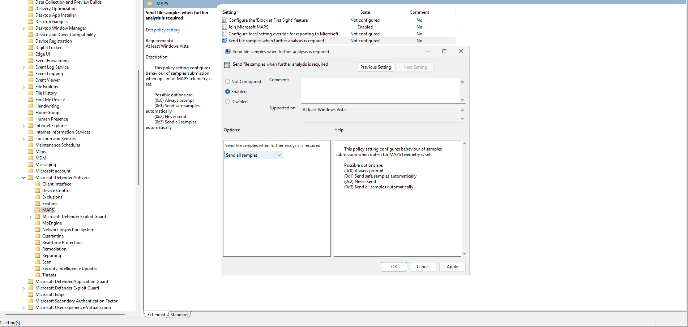
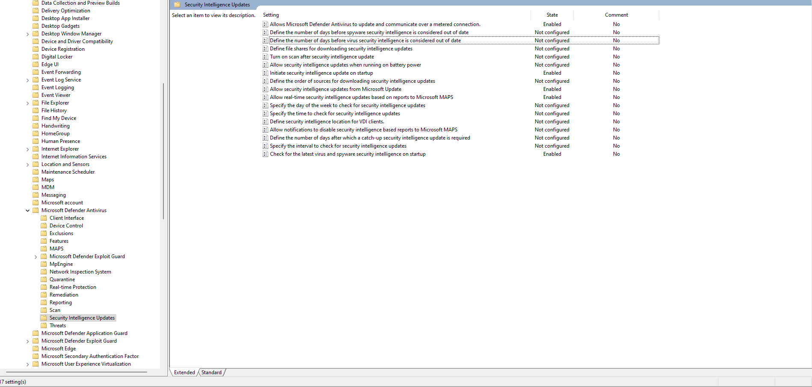

import { Steps } from '@astrojs/starlight/components';

Revisions

Author | Date | Changes
--- | --- | ---
contactit.fr | 01/09/2023 | Initial push

Windows Defender is the **native** security **organ** of Windows **distributions**. Often considered "ineffective," its true potential is poorly understood. What can be criticized about Defender, however, is that its **default** protection is somewhat too **minimal** on machines.

This is entirely understandable, since, as usual, Windows needs to be: backward-compatible and cater to as many use cases as possible. That’s why Windows has deemed the basic configuration appropriate for everyone. As we all know, **users rarely explore the settings.**

**The more advanced the system's security, the greater the risk of encountering user-blocking elements.** This is a constant balance that all IT staff play with continuously.

:::caution[Computing changes!]
It's important to note that computing constantly changes, with systems having lifecycles, vulnerabilities, and updates. These elements can create instabilities and require significant maintenance.
:::

The following diagram summarizes IT security in general. Throughout this tutorial, it will be up to you to define your "security level" based on your needs and accept the potential consequences! That's why **it's imperative to back up your data before any action.**

[!badge size="l" icon="alert" variant="danger" text="**Create a Windows restore point first!**"]

How to do it?

<Steps>

1. Search for "Create a restore point" in the Windows Start menu.

   

2. Click on Create.

   

3. Name and create the restore point.

   

4. Restore point creation in progress...

   

5. Close the window.

   

</Steps>

---

## ⚠️ Paranoid Setup

This configuration significantly increases the resource usage (CPU/RAM) of the machine.
You need a valid **Windows 10/11 Professional** or higher copy to follow this procedure.

Go to **"Group Policy Objects"** from the Start menu, for example, then to `Computer Configuration > Administrative Templates > Windows Components > Microsoft Defender Antivirus`. All the configurations presented are within this object hierarchy. The **"Enabled"** items are to be activated manually by following the screenshots below.

Under the **"MAPS"** section:

Under the **"MpEngine"** section:

Under the **"Real-Time Protection"** section:

Under the **"Scan"** section:

Under the **"Security Intelligence Update"** section:

