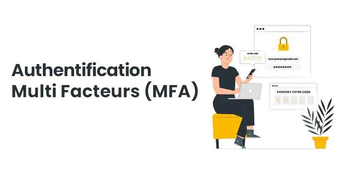
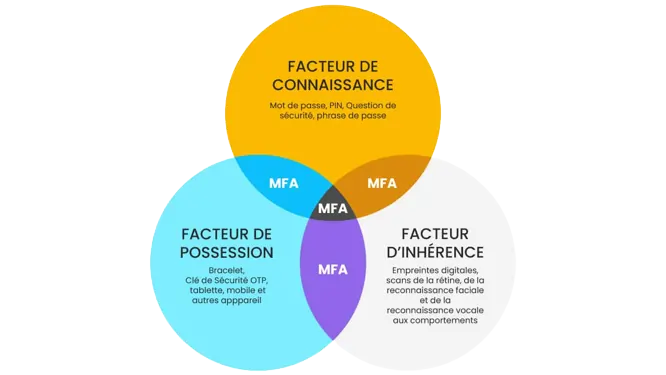

Revisions

Author | Date | Changes
--- | --- | ---
contactit.fr | 30/08/2023 | Initial push

:information_source: Multifactor authentication (MFA) is a method of computer security that requires the user to provide at least two distinct types of information to verify their identity. These factors generally fall into three categories:  

- **Something you know**: This is usually a password or a PIN.  

- **Something you have**: A physical device, such as a phone or a security key (e.g., <a href="https://www.yubico.com/la-cle-yubikey/?lang=fr" target="_blank">YubiKey</a>), that generates a unique code or receives an authentication message.  

- **Something you are**: Biometric characteristics, such as fingerprints, facial recognition, or iris scanning.  

Even if one factor is compromised, an attacker would still need access to other factors to successfully authenticate. This reduces the risks associated with brute force attacks and phishing attempts, thereby strengthening account protection.
