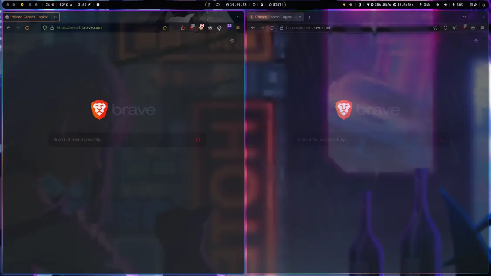

import { Steps, Icon } from '@astrojs/starlight/components';

:::caution[This documentation is a work in progress]
There may be some errors.  
If you notice any, please contact me [here](mailto:contactit.yarka@slmail.me)
::: 

The Exegol Cheat Sheet is a summary of relevant commands and concepts related to the Exegol project, as I see them.  

<Steps>

1. Installation

   Exegol relies on Docker; if it's not installed on your system, install it using this command:

   ```sh
   curl -fsSL "https://get.docker.com/" -o get-docker.sh && sh get-docker.sh
   ```
   
   <Steps>

   1. Add the user to the Docker group

      Allow the current user to use Docker and therefore Exegol without privilege elevation:

      ```sh
      sudo usermod -aG docker $(id -u -n) && newgrp docker
      ```

   2. Install Exegol with PIPX

      The simplest and cleanest way to install the Python Exegol project (in stable main branch version):

      > Requires pipx; install it if needed: `sudo apt install pipx`

      ```sh
      pipx install exegol
      ```

      :::note
      pipx will automatically create the symlinks for the Python venv so that the binary call works without issues.
      The <a href="[https://privatebin.net](https://peps.python.org/pep-0668/)" target="_blank">PEP668</a> recently introduced by major GNU/Linux distributions does not allow system-side Python package installation, especially with pip.
      For a good reason, as many Python projects have been developed on a specific version of Python with specific dependency versions, generally installed with pip install -r requirements.txt.

      This can cause significant dependency issues between projects, which is why Python environments MUST be isolated (ideally) for each project, either by creating a venv or by using pipx, which makes the operation quick and simple for the user. This is why every Python project installed in the Docker images provided by Exegol includes an associated venv.
      ::: 

   3. Add autocompletion

      Add this to your .bashrc or .zshrc:

      ```sh title="~/.bashrc"
      eval "$(register-python-argcomplete --no-defaults exegol)"
      ```

   4. Install an Exegol Docker image

      ```sh
      exegol install nightly
      ```

   </Steps>

2. Upgrade exegol

   ```sh
   pipx upgrade exegol
   ```

3. Offline resources

   Offline resources are stored in /opt/resources, which is shared between the host system and the Docker containers. This directory by default stores useful tools for pentesting, such as:  
   <Icon name="right-arrow" />winpeas
   <Icon name="right-arrow" />linpeas
   <Icon name="right-arrow" />...

   The goal is to save time and facilitate transfer to a target.

4. Usage

   <Icon name="right-arrow" />Install an image: `exegol install`
   <Icon name="right-arrow" />Create/start/enter a container: `exegol start`
   <Icon name="right-arrow" />Show info on containers and images: `exegol info`
   <Icon name="right-arrow" />Stop a container: `exegol stop`
   <Icon name="right-arrow" />Remove a container: `exegol remove`
   <Icon name="right-arrow" />Uninstall an image: `exegol uninstall`
   <Icon name="right-arrow" />Get help and advanced usage: `exegol --help`
   <Icon name="right-arrow" />Help and examples can be obtained for each action directly from the wrapper with the following command: `exegol <action> -h` (action: install/start/stop/etc.).

5. Install Exegol in beta version

   The beta version (dev branch) of Exegol offers several features, including the much-anticipated remote desktop (via web) on a container. If you already have Exegol installed:  

   <Steps>

   1. Uninstall the standard version:

      ```sh
      pipx uninstall exegol
      ```

   2. It is necessary to install Exegol from the GitHub repository:

      ```sh
      git clone "https://github.com/ThePorgs/Exegol"
      ```

   3. Install the Python dependencies:

      ```sh
      python3 -m pip install --user --requirement "Exegol/requirements.txt" --break-system-packages
      ```

      > Here the `--break-system-packages` option ignores **PEP668**.

   4. Add Exegol to the PATH:

      :::caution[Cleanup]
      If you uninstalled a previous version of Exegol before, remove the old file: `sudo rm -f /usr/local/bin/exegol`
      :::

      ```sh
      sudo ln -s "$(pwd)/Exegol/exegol.py" "/usr/local/bin/exegol"
      ```
   5. Update to the beta or dev branch:

      ```sh
      exegol update -v
      ```

   6. You will be asked to choose the version of your branch in the Git repo; choose dev.

   7. You will then need to update the project's Python dependencies (the command will appear in your terminal).
   
   </Steps>

6. Launch a container with remote desktop via web access

   ```sh
   exegol start test nightly --desktop
   ```

7. Fix Evil-WinRM (Deprecated, fixed)

   Exegol has an issue with OpenSSL implementation when running Evil-WinRM. To fix this, we need to modify the openssl.cnf file (find [openssl_init] and replace it with the configuration below):

   ```sh title="/etc/ssl/openssl.cnf"
   [openssl_init]
   providers = provider_sect

   # List of providers to load
   [provider_sect]
   default = default_sect
   legacy = legacy_sect

   [default_sect]
   activate = 1
   [legacy_sect]
   activate = 1
   ```
8. Tips

   Since I mainly use Firefox and it is the default browser in the containers, I sometimes accidentally download something on my host instead of in the container. Since I use Hyprland, window titles no longer appear. To solve this, I haven't brought back the titles, but I've configured Exegol to install a Firefox theme in each container. This way, the two windows are easily distinguishable as shown in the image below.

   

   I also added **uBlock Origin** to all containers to block ads (cookie prompts, ads, trackers...) by editing the following file:

   ```sh title="~/.exegol/my-resources/setup/firefox/addons.txt"
   # This file can be used to install addons on the Firefox instance of Exegol.
   # The download links of the addons to be installed can be listed in this file (ie: https://addons.mozilla.org/fr/firefox/addon/foxyproxy-standard/).
   # All addons listed below will be downloaded and installed automatically when creating a new Exegol container.
   https://addons.mozilla.org/fr/firefox/addon/ublock-origin/
   https://addons.mozilla.org/fr/firefox/addon/rainbow-sparkle-animated-theme/
   ```

   A few changes in the history:

   ```sh title="~/.exegol/my-resources/setup/zsh/history"
   burpsuite &> /dev/null &
   python3 -m http.server 80
   ```

   And some personal aliases:

   ```sh titl="~/.exegol/my-resources/setup/zsh/aliases"
   alias http='python3 -m http.server 80'
   alias tun0='ip a sh dev tun0 | grep -oP "(?:[0-9]{1,3}\.){3}[0-9]{1,3}" | tr -d "\n" | xclip -sel c; tun0ip=$(xsel -ob); echo "\033[1;32m[+]\033[0m Successfully copied \033[1;32m$tun0ip\033[0m (tun0) to clipboard !"'
   ```
   
</Steps>

:::caution[NFS Mounting]
If you want to mount NFS shares in an Exegol container, you need to start it with the `--privileged` option.
:::

> Screenshots will come later for each step :)